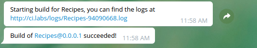

This tool listens for HTTP Post requests coming from [gogs.io](Gogs) and on `tag creation` event, it will run the
Dockerfile specified in the config, passing the TAG build argument with the received `ref`.


# Features

* Notifications of build start, success and failure are pushed to telegram.
  * The notifications include a link to see the build logs.
* Build artifacts are pushed to S3. \*



# TODO
* Support for artifacts instead of hacking around with the dockerfiles
* Move telegram_chat_id to per-repo config

# Configuration

## Environment variables

The following environment variables are used

```
S3_ACCESS_KEY=access_key
S3_SECRET_KEY=secret_key
TELEGRAM_CHAT_ID=XXXXXXX
TELEGRAM_BOT_KEY=XXXXXXXXX:YYYYYYYYYYYYYYYYYYYYYYYYYYYYYYYYYYY
```

## Config file

```json
{
    "LogPath": "/tmp/",
    "repoCloneBase": "/tmp/",
    "Repos": [
    {
        "Name":                      "Recipes",
        "GitUrl":                    "ssh://git@gogs:2222/tati/kitchn.git",
        "RelativePathForDockerfile": "build/Dockerfile"
    },
    {
        "Name":                      "Test Repo",
        "GitUrl":                    "ssh://git@gogs:2222/david/test.git",
        "RelativePathForDockerfile": "build/Dockerfile"
    }
    ]
}

```

